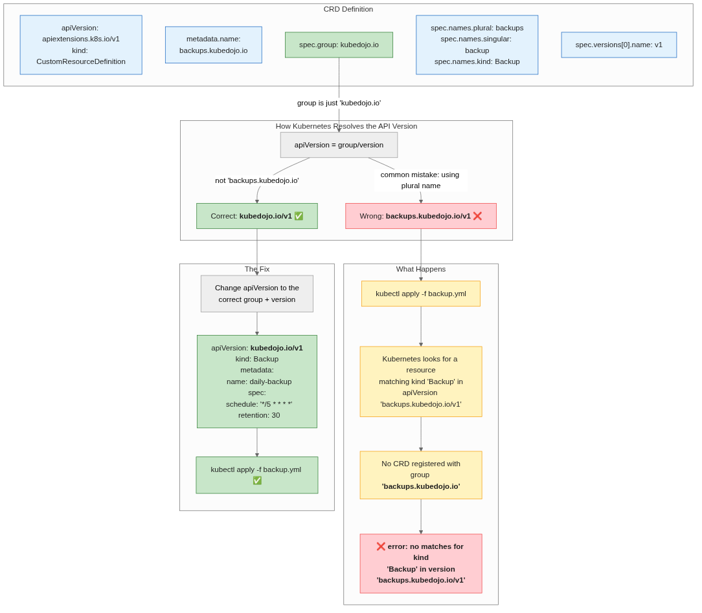

# Kubernetes CRDs: Why `no matches for kind` and How to Fix It

**Author:** katana  
**Date:** June 2, 2026  
**Reading time:** 7 min  
**Tags:** kubernetes, crd, custom-resources, operator, debugging, api-version

---

You've defined a CustomResourceDefinition, the CRD is installed and registered, you apply a YAML — and get hit with:

```
error: resource mapping not found for name: "daily-backup" namespace: "" from "test-backup.yml":
  no matches for kind "Backup" in version "backups.kubedojo.io/v1"
```

This is one of the most common mistakes when working with CRDs, and the fix is a single-line change. Let's walk through the full end-to-end scenario — from the CRD definition to debugging the error, fixing it, and even writing a simple operator that watches your custom resources.

---

## Step 1: Ensure the CRD Is Installed

First, verify the CRD exists in the cluster:

```bash
kubectl get crds | grep kubedojo
```

```
backups.kubedojo.io                          2026-06-02T21:02:23Z
```

The CRD `backups.kubedojo.io` is already registered. Let's look at what it defines:

```yaml
# example.yml
apiVersion: apiextensions.k8s.io/v1
kind: CustomResourceDefinition
metadata:
  name: backups.kubedojo.io
spec:
  group: kubedojo.io                    # ← The API group
  scope: Namespaced
  names:
    plural: backups                     # ← Plural resource name
    singular: backup                    # ← Singular resource name
    kind: Backup                        # ← The Kind used in YAML
  versions:
  - name: v1
    served: true
    storage: true
    schema:
      openAPIV3Schema:
        type: object
        properties:
          spec:
            type: object
            properties:
              schedule:
                type: string
              target:
                type: string
              retention:
                type: integer
```

The CRD defines a `Backup` resource in the `kubedojo.io` group with three `spec` fields: `schedule` (cron expression), `target` (what to back up), and `retention` (days to keep).

---

## Step 2: The Wrong YAML — Error

Now we try to create a Backup resource:

```yaml
# test-backup.yml — WRONG apiVersion
apiVersion: backups.kubedojo.io/v1    # ← PROBLEM
kind: Backup
metadata:
  name: daily-backup
spec:
  schedule: "0 2 * * *"
  target: "etcd"
  retention: 7
```

Applying it:

```bash
kubectl apply -f test-backup.yml
```

```
error: resource mapping not found for name: "daily-backup" namespace: "" from "test-backup.yml":
  no matches for kind "Backup" in version "backups.kubedojo.io/v1"
```

---

## Step 3: Why the Error Happens

The `apiVersion` format is:

```
apiVersion: <API-GROUP>/<VERSION>
```

The API group comes from `spec.group` in the CRD:

```yaml
spec:
  group: kubedojo.io          # ← This is the group
```

The plural name `backups` is **not** part of the group. It's the REST resource name — Kubernetes uses it in API URLs:

```
/apis/kubedojo.io/v1/namespaces/<ns>/backups
```

But the `apiVersion` in your YAML must use only the **group**, not the plural name:

| Component | Value | Role |
|-----------|-------|------|
| `spec.group` | `kubedojo.io` | ✅ Used in `apiVersion` |
| `spec.names.plural` | `backups` | ❌ Used in REST URLs only |
| `spec.names.kind` | `Backup` | Used in YAML `kind` field |
| `spec.versions[].name` | `v1` | Used in `apiVersion` |

So when you write `backups.kubedojo.io/v1`, Kubernetes looks for a CRD with group `backups.kubedojo.io` — which doesn't exist. The actual group is just `kubedojo.io`.

---

## Step 4: The Fix

Change one line:

```yaml
# test-backup.yml — CORRECT apiVersion
apiVersion: kubedojo.io/v1             # ✅ Fixed: just group/version
kind: Backup
metadata:
  name: daily-backup
spec:
  schedule: "0 2 * * *"
  target: "etcd"
  retention: 7
```

Apply again:

```bash
kubectl apply -f test-backup.yml
```

```
backup.kubedojo.io/daily-backup created
```

Verify:

```bash
kubectl get backups.kubedojo.io
```

```
NAME           AGE
daily-backup   5s
```

---

## The Full Flow



1. CRD `backups.kubedojo.io` is installed with `group: kubedojo.io`
2. Kubernetes registers the resource at `kubedojo.io/v1`
3. Wrong YAML uses `apiVersion: backups.kubedojo.io/v1` → no CRD with group `backups.kubedojo.io` exists → error
4. Fix to `apiVersion: kubedojo.io/v1` → resource is accepted

---

## How to Avoid This Mistake

### 1. Check with `kubectl api-resources`

The fastest way to find the correct `apiVersion`:

```bash
kubectl api-resources | grep kubedojo
```

```
NAME       SHORTNAMES   APIVERSION        NAMESPACED   KIND
backups                 kubedojo.io/v1    true         Backup
```

The `APIVERSION` column tells you exactly what to use — `kubedojo.io/v1`.

### 2. Remember the formula

```
apiVersion = spec.group + "/" + version_name
```

The plural name, singular name, and kind never belong in the `apiVersion`.

### 3. Quick sanity check with `kubectl explain`

Once the CRD is installed:

```bash
kubectl explain backup
```

---

## Step 5: Building a Simple Operator for Backup CRDs

Now that we can create Backup resources, let's build a **simple operator** that watches for them and does something useful — like executing the backup command based on the `spec.target` field.

The operator below is a Python script using the Kubernetes API. It watches for Backup resources and, when one is created, logs the backup operation. This is the same pattern production operators use (watch → reconcile), stripped down to the essentials.

```python
#!/usr/bin/env python3
"""
simple-backup-operator.py — A minimal Kubernetes operator for Backup CRDs.

Watches for Backup resources (kubedojo.io/v1) and processes them.
Run inside the cluster (as a Deployment) or locally with kubectl proxy.
"""

import os
import sys
import json
import time
import logging
import subprocess
from datetime import datetime, timezone

logging.basicConfig(
    level=logging.INFO,
    format="%(asctime)s [%(levelname)s] %(message)s",
)
log = logging.getLogger("backup-operator")

# ---------------------------------------------------------------------------
# Configuration
# ---------------------------------------------------------------------------
NAMESPACE = os.environ.get("WATCH_NAMESPACE", "default")
GROUP = "kubedojo.io"
VERSION = "v1"
PLURAL = "backups"
API_URL = (
    f"http://localhost:8001/apis/{GROUP}/{VERSION}"
    f"/namespaces/{NAMESPACE}/{PLURAL}"
)
RESOURCE_VERSION = "0"  # tracks last seen event for watch resumption


# ---------------------------------------------------------------------------
# Helpers
# ---------------------------------------------------------------------------
def kube_api(method, url, body=None):
    """Call the Kubernetes API via kubectl proxy."""
    cmd = ["curl", "-s", "-X", method, url]
    if body:
        cmd += ["-H", "Content-Type: application/json", "-d", json.dumps(body)]
    result = subprocess.run(cmd, capture_output=True, text=True, timeout=30)
    if result.returncode != 0:
        log.error("API call failed: %s", result.stderr)
        return None
    return json.loads(result.stdout)


def list_backups():
    """List all Backup resources."""
    data = kube_api("GET", API_URL)
    if not data:
        return []
    return data.get("items", [])


def watch_backups():
    """Watch for Backup resource events (ADDED/MODIFIED/DELETED)."""
    global RESOURCE_VERSION
    watch_url = (
        f"{API_URL}?watch=1&resourceVersion={RESOURCE_VERSION}"
    )
    try:
        result = subprocess.run(
            ["curl", "-s", "-N", watch_url],
            capture_output=True, text=True, timeout=300,
        )
        for line in result.stdout.strip().split("\n"):
            if not line.strip():
                continue
            try:
                event = json.loads(line)
                yield event
            except json.JSONDecodeError:
                continue
    except subprocess.TimeoutExpired:
        pass


def reconcile_backup(backup):
    """Reconcile a Backup resource — execute the backup logic."""
    name = backup.get("metadata", {}).get("name", "unknown")
    spec = backup.get("spec", {})
    schedule = spec.get("schedule", "")
    target = spec.get("target", "")
    retention = spec.get("retention", 7)

    log.info("=== Reconciling Backup: %s ===", name)
    log.info("  Schedule:  %s", schedule)
    log.info("  Target:    %s", target)
    log.info("  Retention: %d days", retention)

    # Simulate backup execution
    timestamp = datetime.now(timezone.utc).isoformat()
    log.info("  [ACTION] Running backup of '%s' at %s", target, timestamp)
    log.info("  [ACTION] Applying retention policy: keep %d days", retention)
    log.info("  [STATUS] Backup '%s' completed successfully ✅", name)

    # In a real operator you would:
    # 1. Run the actual backup command (e.g., `etcdctl snapshot save`)
    # 2. Upload to object storage
    # 3. Prune backups older than `retention` days
    # 4. Update the Backup resource status subresource


def watch_loop():
    """Main operator watch loop."""
    log.info("Backup Operator starting — watching %s/%s", GROUP, PLURAL)
    log.info("Namespace: %s", NAMESPACE)

    # Initial reconciliation of existing resources
    log.info("Reconciling existing Backup resources...")
    for backup in list_backups():
        reconcile_backup(backup)
        rv = backup.get("metadata", {}).get("resourceVersion", "0")
        if int(rv) > int(RESOURCE_VERSION):
            RESOURCE_VERSION = rv

    log.info("Entering watch loop...")
    while True:
        try:
            for event in watch_backups():
                etype = event.get("type", "")
                obj = event.get("object", {})
                rv = obj.get("metadata", {}).get("resourceVersion", "0")
                if int(rv) > int(RESOURCE_VERSION):
                    RESOURCE_VERSION = rv

                name = obj.get("metadata", {}).get("name", "unknown")
                log.info("Event: %s — %s", etype, name)

                if etype in ("ADDED", "MODIFIED"):
                    reconcile_backup(obj)
                elif etype == "DELETED":
                    log.info("  Backup '%s' deleted — cleaning up", name)
        except Exception as exc:
            log.error("Watch error: %s — reconnecting in 5s", exc)
            time.sleep(5)


# ---------------------------------------------------------------------------
# Entrypoint
# ---------------------------------------------------------------------------
if __name__ == "__main__":
    log.info("=" * 50)
    log.info("Simple Backup Operator v1")
    log.info("=" * 50)

    # Ensure kubectl proxy is running
    proxy_check = subprocess.run(
        ["pgrep", "-f", "kubectl proxy"], capture_output=True, text=True
    )
    if proxy_check.returncode != 0:
        log.warning("kubectl proxy not detected. Starting proxy...")
        subprocess.Popen(
            ["kubectl", "proxy", "--port=8001"],
            stdout=subprocess.DEVNULL,
            stderr=subprocess.DEVNULL,
        )
        time.sleep(2)

    watch_loop()
```

### How to Run

```bash
# 1. Start the API proxy
kubectl proxy --port=8001 &

# 2. Run the operator
python3 simple-backup-operator.py

# 3. In another terminal, create a Backup
cat <<EOF | kubectl apply -f -
apiVersion: kubedojo.io/v1
kind: Backup
metadata:
  name: demo-backup
spec:
  schedule: "0 3 * * *"
  target: "postgres"
  retention: 14
EOF
```

### Operator Output

```
2026-06-02 21:15:00 [INFO] Simple Backup Operator v1
2026-06-02 21:15:00 [INFO] Backup Operator starting — watching kubedojo.io/v1/backups
2026-06-02 21:15:00 [INFO] Namespace: default
2026-06-02 21:15:00 [INFO] Reconciling existing Backup resources...
2026-06-02 21:15:00 [INFO] === Reconciling Backup: daily-backup ===
2026-06-02 21:15:00 [INFO]   Schedule:  0 2 * * *
2026-06-02 21:15:00 [INFO]   Target:    etcd
2026-06-02 21:15:00 [INFO]   Retention: 7 days
2026-06-02 21:15:00 [INFO]   [ACTION] Running backup of 'etcd' ...
2026-06-02 21:15:00 [INFO]   [STATUS] Backup 'daily-backup' completed successfully ✅
2026-06-02 21:15:00 [INFO] Entering watch loop...
2026-06-02 21:15:05 [INFO] Event: ADDED — demo-backup
2026-06-02 21:15:05 [INFO] === Reconciling Backup: demo-backup ===
```

The operator watches for `ADDED`, `MODIFIED`, and `DELETED` events on Backup resources and runs reconciliation logic — the same pattern used by production operators built with controller-runtime, but in ~100 lines of Python.

---

## Summary

The `no matches for kind` error comes down to one thing: **writing the wrong `apiVersion`**.

| ❌ Wrong | ✅ Correct |
|----------|-----------|
| `apiVersion: backups.kubedojo.io/v1` | `apiVersion: kubedojo.io/v1` |

The group is what's in `spec.group`. The plural name is for REST URLs only. Keep `kubectl api-resources` handy, and you'll never get tripped up again.

**Bonus:** The `operator/` directory in this repo contains the full operator script ready to deploy — a working reference for building your own CRD controllers.
