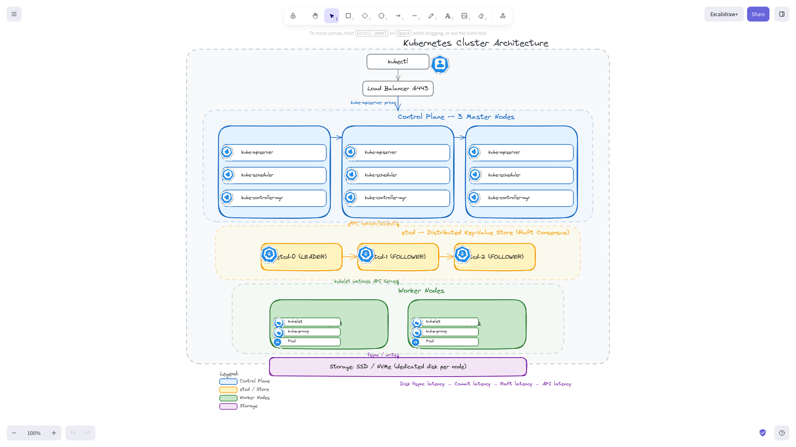
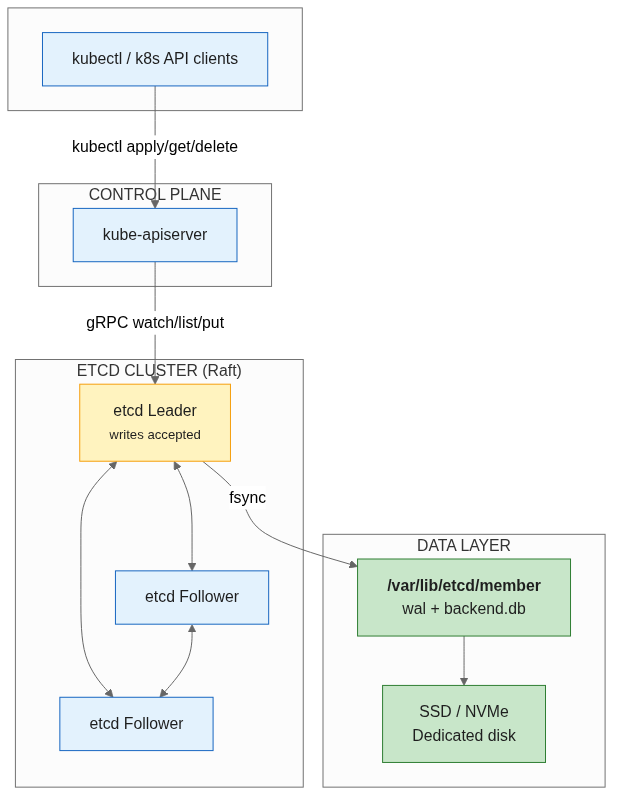
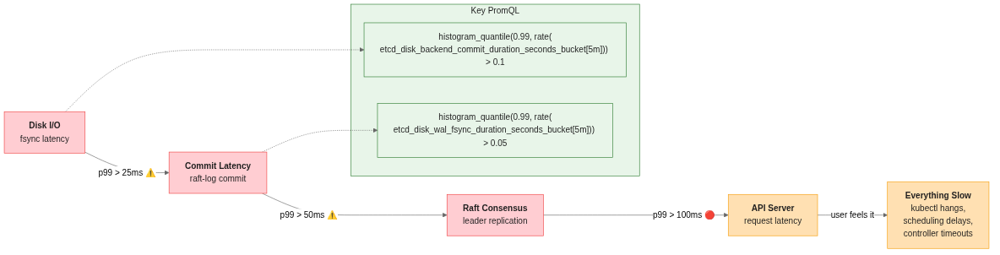
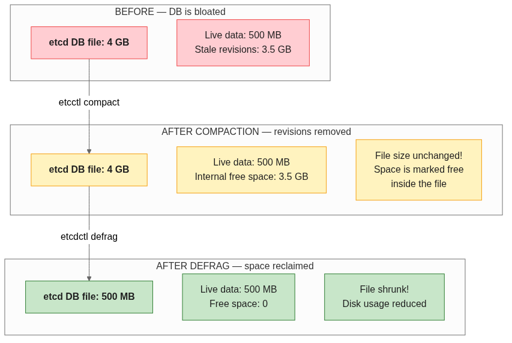
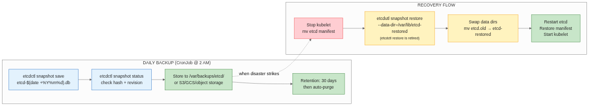

# etcd in Production: Management, Performance, and What Every Kubernetes Admin Must Know

**Author:** katana
**Date:** May 31, 2026
**Reading time:** 15 min
**Tags:** kubernetes, etcd, performance, ops, CKA



---

## Table of Contents

1. [Why etcd Matters](#why-etcd-matters)
2. [What etcd Stores](#what-etcd-stores)
3. [etcdctl: The Swiss Army Knife](#etcdctl-the-swiss-army-knife)
4. [Performance Management](#performance-management)
5. [DB Bloat, Compaction, and Defrag](#db-bloat-compaction-and-defrag)
6. [Backup & Recovery](#backup--recovery)
7. [Monitoring & Alarms](#monitoring--alarms)
8. [Production Patterns](#production-patterns)
9. [Common Pitfalls](#common-pitfalls)
10. [Conclusion](#conclusion)

---

## Why etcd Matters

etcd is the source of truth for your Kubernetes cluster. Every `kubectl apply`, every pod schedule, every node join — it all goes through etcd. If etcd is slow or unhealthy, **everything** is slow or broken.

> **etcd health ≈ Kubernetes API health.** There is no workaround, no bypass, no cache layer between etcd and the API Server.

This is the single most important thing to internalize about etcd in Kubernetes: **disk latency directly drives API latency.** A 10ms write latency on your etcd disk translates to visible slowdowns in `kubectl` commands, pod scheduling delays, and controller loops timing out.



---

## What etcd Stores

etcd is a distributed key-value store based on the Raft consensus protocol. In a Kubernetes context, it stores:

| Category | Examples | What happens when it grows |
|----------|----------|---------------------------|
| **Cluster state** | Nodes, namespaces, RBAC rules | Slow list/watch queries |
| **Workloads** | Pods, Deployments, Services, ConfigMaps, Secrets | Most of the keyspace |
| **Metadata** | Events, resource versions, lease objects | Events cause rapid write churn |
| **Internal state** | CRD instances, controller revisions | If CRDs are leaky, this grows unbounded |

Every object in Kubernetes is stored in etcd as a key-value pair. The value is the full object serialized as JSON or protobuf. **The total size of all keys and values is what determines your etcd database file size.**

---

## etcdctl: The Swiss Army Knife

Before `etcdctl`, you're guessing. After `etcdctl`, you have data. All commands here use `ETCDCTL_API=3` (the default in recent versions, but explicit is better than implicit).

### Authentication Setup

Most production clusters secure etcd with TLS certificates. You'll often source these from a helper script or pass them inline:

```bash
# Typical kubeadm-based cluster certs location
ETCDCTL_API=3 etcdctl \
  --cacert=/etc/kubernetes/pki/etcd/ca.crt \
  --cert=/etc/kubernetes/pki/etcd/server.crt \
  --key=/etc/kubernetes/pki/etcd/server.key \
  <command>
```

Many environments define a helper alias to avoid typing this every time:

```bash
alias ectl='ETCDCTL_API=3 etcdctl \
  --cacert=/etc/kubernetes/pki/etcd/ca.crt \
  --cert=/etc/kubernetes/pki/etcd/server.crt \
  --key=/etc/kubernetes/pki/etcd/server.key'
```

### Essential Commands

**Cluster health — first thing you check when something feels off:**

```bash
etcdctl endpoint health --cluster -w table
+----------------------------+--------+-------------+-------+
|          ENDPOINT          | HEALTH |    TOOK     | ERROR |
+----------------------------+--------+-------------+-------+
| https://10.0.0.1:2379      |  true  |  2.345678ms |       |
| https://10.0.0.2:2379      |  true  |  1.987654ms |       |
| https://10.0.0.3:2379      |  true  |  2.123456ms |       |
+----------------------------+--------+-------------+-------+
```

**Endpoint status — revision number, DB size per member:**

```bash
etcdctl endpoint status --cluster -w table
+----------------------------+------------------+---------+---------+-----------+------------+-----------+------------+--------------------+--------+
|          ENDPOINT          |        ID        | VERSION | DB SIZE | IN USE |  IS LEARNER | RAFT TERM | RAFT INDEX | RAFT APPLIED INDEX | ERRORS |
+----------------------------+------------------+---------+---------+-----------+------------+-----------+------------+--------------------+--------+
| https://10.0.0.1:2379      | 8e9e05c52164694d |   3.5.9 |  128 MB |   true |      false |        14 |   10234567 |          10234567 |        |
+----------------------------+------------------+---------+---------+-----------+------------+-----------+------------+--------------------+--------+
```

**Member list — verify cluster membership:**

```bash
etcdctl member list -w table
+------------------+---------+--------+----------------------------+----------------------------+------------+
|        ID        | STATUS  |  NAME  |         PEER ADDRS         |        CLIENT ADDRS        | IS LEARNER |
+------------------+---------+--------+----------------------------+----------------------------+------------+
| 8e9e05c52164694d | started | etcd-0 | https://10.0.0.1:2380      | https://10.0.0.1:2379      |      false |
| 9f0f16d632757a5e | started | etcd-1 | https://10.0.0.2:2380      | https://10.0.0.2:2379      |      false |
| b01c17e743868b6f | started | etcd-2 | https://10.0.0.3:2380      | https://10.0.0.3:2379      |      false |
+------------------+---------+--------+----------------------------+----------------------------+------------+
```

**Alarm management — check for active alarms (NOSPACE is the big one):**

```bash
etcdctl alarm list
memberID:8e9e05c52164694d alarm:NOSPACE
```

Clear an alarm after fixing the root cause:
```bash
etcdctl alarm disarm
```

**Snapshot backup — the lifeline of disaster recovery:**

```bash
etcdctl snapshot save /backup/etcd-$(date +%Y%m%d).db
{"level":"info","msg":"created snapshot db at /backup/etcd-20260531.db"}
```

**Check a snapshot file — verify integrity before relying on it:**

```bash
etcdctl snapshot status /backup/etcd-20260531.db -w table
+----------+----------+------------+------------+
|   HASH   | REVISION | TOTAL KEYS | TOTAL SIZE |
+----------+----------+------------+------------+
|  abc123  |   345678 |       2048 |    256 MB  |
+----------+----------+------------+------------+
```

**Compact — reclaim space from old revisions:**

```bash
# Compact all revisions up to revision N
etcdctl compact 345678
```

**Defrag — actually reclaim the disk space after compaction:**

```bash
# Run on each member (etcd must be the leader or follower — it's safe on followers)
etcdctl defrag
Finished defragmenting etcd member[8e9e05c52164694d]
```

---

## Performance Management

### The Three-Layer Performance Model

etcd performance breaks down into three layers, and problems in any layer impact the API Server:

```
Disk I/O  →  Raft consensus  →  Watch/List performance
   ↓              ↓                     ↓
commit latency  write latency      read latency
```

### Key Metrics

| Metric | What it measures | Warning threshold | Critical threshold |
|--------|-----------------|-------------------|--------------------|
| `etcd_disk_backend_commit_duration` | fsync latency for each commit to backend DB | p99 > 25ms | p99 > 100ms |
| `etcd_disk_wal_fsync_duration` | fsync latency for write-ahead log | p99 > 10ms | p99 > 50ms |
| `etcd_network_peer_round_trip_time` | RTT between etcd members | p99 > 100ms | p99 > 200ms |
| `etcd_server_leader_changes_seen_total` | Leader elections | > 1 in 5 min | > 3 in 5 min |
| `etcd_mvcc_db_total_size_in_bytes` | Current DB size on disk | > 2 GB | > 4 GB |
| `etcd_mvcc_db_total_size_in_use_in_bytes` | Actual data (not freed by compaction) | > 1 GB | > 2 GB |

### Disk Performance Is Everything

The single most overlooked etcd performance factor is **disk type and provisioning**:

- **SSD or NVMe** — mandatory for any cluster with >10 nodes or >100 pods
- **Dedicated disk** — don't share the etcd data disk with OS logs, container images, or application data
- **IOPS provisioning** — in the cloud, ensure your etcd node's disk has sufficient IOPS. A t3.medium with a gp2 EBS volume at 100 IOPS will throttle etcd under load.
- **fsync** — etcd calls `fsync` after every commit. This is the bottleneck. Lower-latency fsync = faster etcd.

**The PromQL for the most important etcd alert:**

```
# Backend commit latency — p99 should stay under 100ms
histogram_quantile(0.99,
  rate(etcd_disk_backend_commit_duration_seconds_bucket[5m])
) > 0.1

# WAL fsync latency — p99 should stay under 50ms
histogram_quantile(0.99,
  rate(etcd_disk_wal_fsync_duration_seconds_bucket[5m])
) > 0.05
```



---

## DB Bloat, Compaction, and Defrag

### Why etcd Blows Up

etcd is an **MVCC (Multi-Version Concurrency Control)** store. Every write creates a new revision of the key without deleting the old one. This means:

- Creating and deleting a Secret 100 times = 100 revisions in etcd
- Updating a ConfigMap every minute = hundreds of stale revisions per day
- Kubernetes Events = constant write churn (events are created and expire continuously)

The DB file grows with every revision, even if the "live" data is small.

### Compaction — Removing Old Revisions

Compaction marks old revisions as freeable. It does **not** shrink the DB file on disk, but it makes space available for new writes.

**Manual compaction (what they test in CKA):**

```bash
# Get current revision
REV=$(etcdctl endpoint status --write-out="json" | jq -r '.[0].Status.header.revision')

# Compact everything older than 1000 revisions ago
etcdctl compact $((REV - 1000))
```

**Automatic compaction (configured in etcd manifest):**

```yaml
# In the etcd pod spec or systemd unit:
--auto-compaction-retention=8    # Keep 8-hour window of revisions
--auto-compaction-mode=revision  # Or "periodic" for time-based
```

Most clusters use `--auto-compaction-retention=8` (periodic mode, 8 hour window). This keeps the revision history manageable automatically.

### Defragmentation — Reclaiming Disk Space

Compaction frees space inside the DB file, but the file stays the same size on disk. **Defragmentation is what actually shrinks it.**

```bash
# Run on each etcd member, one at a time
etcdctl defrag
```

**Critical rule:** Defrag is a blocking operation (brief pause). Defrag followers first, then the leader, to minimize impact:

```bash
# Step 1: Defrag each follower
for member in member-a member-b; do
  ssh $member "ETCDCTL_API=3 etcdctl --endpoints=https://$member:2379 defrag"
done

# Step 2: Defrag the leader last
etcdctl defrag
```

### DB Size Guidelines

| Cluster size | Target DB size | When to compact aggressively |
|-------------|---------------|------------------------------|
| Dev/lab (<5 nodes) | < 500 MB | When it hits 1 GB |
| Production small (5-20 nodes) | < 2 GB | When it hits 4 GB |
| Production large (20-100 nodes) | < 4 GB | When it hits 8 GB |
| Very large (100-500 nodes) | < 8 GB | When growth exceeds 1 GB/week |

> **etcd has a hard limit of 8 GB by default** (`--quota-backend-bytes=8589934592`). If your DB crosses this, etcd enters maintenance mode and stops accepting writes. You get `NOSPACE` and nothing works.



---

## Backup & Recovery

### Snapshot Backup

Never rely on filesystem-level backups of etcd's data directory. Always use `etcdctl snapshot save`.

> **Note on tools:** `etcdctl` handles live operations (save, status, member management).  
> `etcdutl` handles offline operations — specifically `snapshot restore`. The old `etcdctl snapshot restore` is retired.

```bash
# Daily snapshot
etcdctl snapshot save /backup/etcd-$(date +%Y%m%d).db

# Verify
etcdctl snapshot status /backup/etcd-$(date +%Y%m%d).db -w table
```

### Restore from Snapshot

Restoring etcd from snapshot requires stopping etcd, restoring data, and re-initializing the cluster:

```bash
# Stop kubelet and etcd
systemctl stop kubelet
# If static pod:
mv /etc/kubernetes/manifests/etcd.yaml /etc/kubernetes/

# Restore from snapshot (etcdutl, not etcdctl — etcdctl snapshot restore is retired)
etcdutl snapshot restore /backup/etcd-20260531.db \
  --data-dir=/var/lib/etcd-restored \
  --initial-cluster=etcd-0=https://10.0.0.1:2380 \
  --initial-advertise-peer-urls=https://10.0.0.1:2380 \
  --name=etcd-0

# Point etcd to restored data
mv /var/lib/etcd /var/lib/etcd.old
mv /var/lib/etcd-restored /var/lib/etcd

# Start etcd
mv /etc/kubernetes/etcd.yaml.backup /etc/kubernetes/manifests/etcd.yaml
systemctl start kubelet
```

### Key Recovery Facts

- `etcdutl snapshot restore` creates a **new cluster** from the snapshot — the member IDs and cluster ID change (`etcdctl snapshot restore` is retired)
- You restore one snapshot per etcd member, but they must all restore from the same snapshot
- On a multi-member cluster, you effectively rebuild the cluster from the snapshot
- There is no "incremental" restore — it's snapshot or nothing



---

## Monitoring & Alarms

### etcd Alarms

etcd has a built-in alarm system. The alarm you will see in production most often:

| Alarm | Meaning | Action |
|-------|---------|--------|
| `NOSPACE` | DB exceeded quota (8 GB default) | Compact, defrag, or increase quota. Immediate recovery priority. |
| `CORRUPT` | Data integrity issue | Restore from snapshot. Rare, but critical. |

Check for alarms regularly — this should be in your monitoring dashboard:

```bash
etcdctl alarm list
```

If `NOSPACE`: compact → defrag → disarm alarm. Nothing writes to etcd while `NOSPACE` is active.

### Prometheus Metrics Pipeline

The standard monitoring stack for etcd:

```
etcd /metrics  →  Prometheus  →  Grafana dashboard  →  Alerts
```

The most important dashboards and alerts:

1. **Disk fsync latency per member** (p99 and p50)
2. **DB size and in-use size** (track deltas over time)
3. **Leader changes** (should be near-zero)
4. **Failed proposals** (signals Raft or disk issues)
5. **gRPC request latency** (what the API Server sees)

### API Server ↔ etcd Relationship

The kube-apiserver proxies etcd metrics at `/metrics`. Look for:

- `etcd_request_duration_seconds` — direct etcd request latency from the API Server's perspective
- `apiserver_storage_db_total_size_in_bytes` — estimated DB size (from the API Server side)
- `apiserver_storage_objects` — object count per resource type

**This is where Secrets and ConfigMaps show up as a problem:**

```promql
# Objects by resource type — if Secrets is 10x ConfigMaps, investigate
sum(apiserver_storage_objects) by (resource)
```

A cluster with 10,000 Secrets (each at a few KB) can easily consume several GB of etcd space. Most of those secrets are unused but etcd stores them all.

---

## Production Patterns

### 1. Automated Backup CronJob

This CronJob runs on the control plane node with host networking, using the etcd image to perform daily snapshots:

```yaml
apiVersion: batch/v1
kind: CronJob
metadata:
  name: etcd-backup
  namespace: kube-system
spec:
  schedule: "0 2 * * *"
  jobTemplate:
    spec:
      template:
        spec:
          hostNetwork: true
          containers:
          - name: backup
            image: k8s.gcr.io/etcd:3.5.9-0
            command:
            - /bin/sh
            - -c
            - ETCDCTL_API=3 etcdctl --cacert=/etc/kubernetes/pki/etcd/ca.crt
              --cert=/etc/kubernetes/pki/etcd/server.crt
              --key=/etc/kubernetes/pki/etcd/server.key
              snapshot save /backup/etcd-$(date +%Y%m%d).db
            volumeMounts:
            - name: etcd-certs
              mountPath: /etc/kubernetes/pki/etcd
            - name: backup
              mountPath: /backup
          volumes:
          - name: etcd-certs
            hostPath:
              path: /etc/kubernetes/pki/etcd
          - name: backup
            hostPath:
              path: /var/backups/etcd
          restartPolicy: OnFailure
```

**What to check after deploying:** Does the Pod actually start? Does it have cert access? Is the backup directory writable?

### 2. Automated Compaction

A cron job on the control plane node to compact old revisions nightly:

```bash
# /etc/cron.d/etcd-compaction
0 3 * * * root ETCDCTL_API=3 etcdctl --cacert=/etc/kubernetes/pki/etcd/ca.crt \
  --cert=/etc/kubernetes/pki/etcd/server.crt \
  --key=/etc/kubernetes/pki/etcd/server.key \
  compact $(etcdctl --cacert=/etc/kubernetes/pki/etcd/ca.crt \
    --cert=/etc/kubernetes/pki/etcd/server.crt \
    --key=/etc/kubernetes/pki/etcd/server.key \
    endpoint status --write-out="json" | jq -r '.[0].Status.header.revision - 1000')
```

**Safety note:** Never compact to revision 0 or close to it. Keep a buffer of at least 1000 revisions (or more, depending on your write rate) to avoid breaking watchers.

### 3. Weekly Defragmentation

Defrag is not safe on a hot cluster — schedule it during maintenance windows:

```bash
# Run on each member sequentially, followers first
for member in <follower-ip> <another-follower-ip>; do
  ssh $member "etcdctl defrag"
done
etcdctl defrag  # leader last
```

### 4. Cleanup of Bloating Objects

If Secrets or ConfigMaps are inflating your DB, clean them up:

```bash
# Remove leftover test ConfigMaps
kubectl delete configmap $(kubectl get cm -o name | grep test-) 2>/dev/null

# Remove leftover test Secrets
kubectl delete secret $(kubectl get secret -o name | grep load-secret-) 2>/dev/null
```

**Better:** Implement label-based cleanup policies and enforce them with Kyverno or OPA.

### 5. Monitoring Latency

The canary check that catches etcd issues before users do:

```bash
# gRPC request latency — anything over 1 second needs investigation
kubectl get --raw /metrics | grep etcd_request_duration_seconds
```

In PromQL form:

```promql
# p99 of etcd backend commit duration should stay under 100ms
histogram_quantile(0.99,
  rate(etcd_disk_backend_commit_duration_seconds_bucket{le="0.1"}[5m])
) < 0.99
```

This rule says: "At least 99% of requests should complete in ≤ 100ms." If this fires, your disk can't keep up.

---

## Common Pitfalls

### 1. Defrag without Compaction

Defrag on an uncompacted DB moves all the dead space around without freeing it. Always compact first, then defrag.

### 2. Snapshot Backup Without Verification

A corrupted snapshot is worse than no backup — it gives false confidence. Always verify:
```bash
etcdctl snapshot status /backup/*.db -w table
```

### 3. Running etcd on Shared Disks

etcd + container logs + OS on the same disk = disaster. The container runtime's I/O competes with etcd's fsync requests. When the disk saturates, etcd loses every time.

### 4. Ignoring NOSPACE

A `NOSPACE` alarm means **writes are failing**. Pod creation, ConfigMap updates, Deployments — everything that writes to the API is broken. Fixing `NOSPACE` is the highest-priority etcd operation.

### 5. Auto-Compaction Disabled

Many kubeadm installations set `--auto-compaction-retention` but some won't. Check:

```bash
grep auto-compaction /etc/kubernetes/manifests/etcd.yaml
```

If it's missing, add it. Without auto-compaction, the DB grows forever (until it hits the 8 GB quota wall).

### 6. Too Many Large Objects

A single Secret larger than 1 MB is a misfit for etcd. Store large configs in external storage (S3, GCS, Vault) and reference them in the cluster. etcd is for cluster state, not object storage.

---

## Quick Reference Card

```
┌──────────────────────────────────────────────────────────────────┐
│                    etcdctl Cheat Sheet                           │
├──────────────────────────────────────────────────────────────────┤
│                                                                  │
│  📊 Health & Status                                              │
│  ─────────────────────                                           │
│  etcdctl endpoint health --cluster -w table                      │
│  etcdctl endpoint status --cluster -w table                      │
│  etcdctl member list -w table                                    │
│                                                                  │
│  💾 Backup & Restore                                             │
│  ─────────────────────                                           │
│  etcdctl snapshot save /path/backup-$(date +%Y%m%d).db          │
│  etcdctl snapshot status /path/backup.db -w table                │
│  etcdutl snapshot restore /path/backup.db \                     │
│    --data-dir=/var/lib/etcd-restored --name=etcd-0               │
│  # ^ etcdctl snapshot restore is retired — use etcdutl instead   │
│                                                                  │
│  🧹 Compaction & Defrag                                          │
│  ──────────────────────────                                       │
│  REV=$(etcdctl endpoint status --write-out=json | jq ...)       │
│  etcdctl compact $((REV - 1000))                                 │
│  etcdctl defrag                               # followers first! │
│                                                                  │
│  🔔 Alarms                                                       │
│  ─────────                                                       │
│  etcdctl alarm list                                              │
│  etcdctl alarm disarm                                            │
│                                                                  │
│  ⚡ Key PromQL queries                                            │
│  ─────────────────────                                           │
│  # Backend commit p99 > 100ms = bad disk                          │
│  histogram_quantile(0.99, rate(                                   │
│    etcd_disk_backend_commit_duration_seconds_bucket[5m])) > 0.1  │
│                                                                  │
│  # Leader changes > 1 in 5m = network issue                      │
│  increase(etcd_server_leader_changes_seen_total[5m]) > 1         │
│                                                                  │
│  # DB size approaching 8 GB quota                                 │
│  etcd_mvcc_db_total_size_in_bytes > 7000000000                   │
│                                                                  │
└──────────────────────────────────────────────────────────────────┘
```

---

## Conclusion

etcd is the quiet backbone of every Kubernetes cluster. It sits there, mostly ignored, until something goes wrong — at which point it becomes the only thing that matters.

The critical chain of dependencies is simple:

```
Disk latency → Commit latency → Raft latency → API Server latency → Everything slow
```

Three things to automate immediately:

1. **Daily snapshots** — `etcdctl snapshot save` + integrity verification
2. **Auto-compaction** — `--auto-compaction-retention=8` or a nightly compact cron
3. **Weekly defrag** — compact → defrag followers → defrag leader

And three things to monitor:

1. **DB size** — trending toward the 8 GB quota wall
2. **Commit latency** — p99 under 100ms or your disk is too slow
3. **Leader changes** — anything beyond zero is a cluster stability event

etcd is boring when it works, and terrifying when it doesn't. The boring version is cheaper.

---

*Tags: kubernetes, etcd, performance, ops, CKA, devops, cluster-administration*
