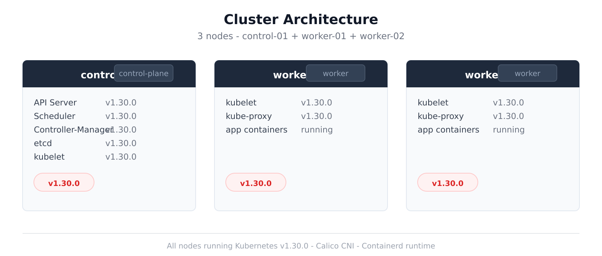
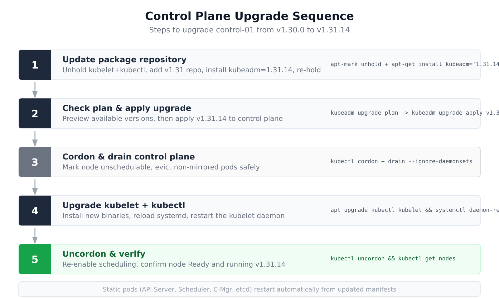
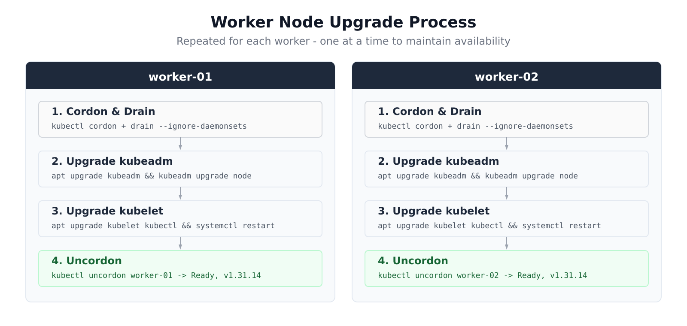
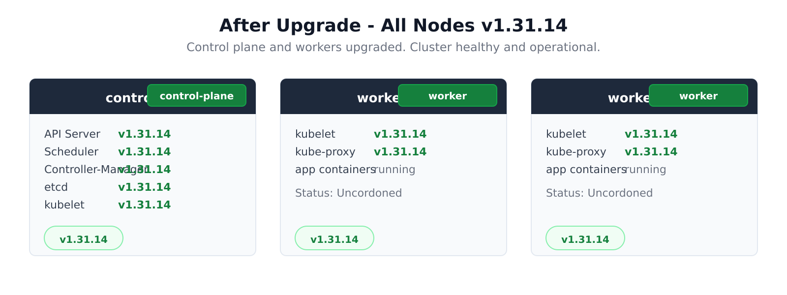
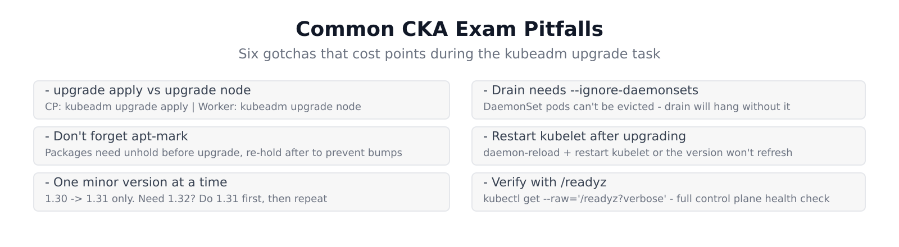

# Step-by-Step: Upgrading a Multi-Node Kubernetes Cluster with kubeadm (v1.30 → v1.31)

**Author:** katana  
**Date:** May 29, 2026  
**Reading time:** 12 min  
**Tags:** kubernetes, kubeadm, upgrade, cka, devops

## Table of Contents

1. [Introduction](#introduction)
2. [Cluster Architecture](#cluster-architecture)
3. [Upgrade Strategy](#upgrade-strategy)
4. [Phase 1: Control Plane Upgrade](#phase-1-control-plane-upgrade)
5. [Phase 2: Worker Node Upgrades](#phase-2-worker-node-upgrades)
6. [Phase 3: Verification](#phase-3-verification)
7. [Result](#result)
8. [Common Pitfalls](#common-pitfalls)
9. [Conclusion](#conclusion)

---

## Introduction

Upgrading a Kubernetes cluster is one of the most frequent operational tasks for any platform engineer. It's also one of the most commonly tested skills in the **CKA (Certified Kubernetes Administrator)** exam. The process follows a strict pattern: control plane first, then workers, one at a time.

This walkthrough covers a real upgrade I performed on a 3-node cluster — from **v1.30.0 to v1.31.14** — using `kubeadm`. Every command was executed against a live cluster on [iximiuz Labs](https://labs.iximiuz.com/challenges/cka-kubeadm-upgrade-ecfc7390), a hands-on CKA practice environment.

The full terminal history from both the control plane node and worker nodes is included so you can see exactly what commands ran, in what order, and what the output looked like.

---

## Cluster Architecture

Our cluster has three nodes: one control plane and two workers. Before the upgrade, all three run Kubernetes v1.30.0 with Calico CNI and containerd runtime.



| Node | Role | Initial Version | Components |
|------|------|----------------|------------|
| `control-01` | control-plane | v1.30.0 | API Server, Scheduler, Controller-Manager, etcd, kubelet |
| `worker-01` | worker | v1.30.0 | kubelet, kube-proxy, application containers |
| `worker-02` | worker | v1.30.0 | kubelet, kube-proxy, application containers |

Each node has 2 CPU and 4 GB RAM — a standard lab configuration that mirrors typical production node sizing.

---

## Upgrade Strategy

Kubernetes enforces a strict upgrade ordering and version skew policy:

1. **Control plane must be upgraded first** — all control plane components (API Server, Scheduler, Controller-Manager, etcd) need to be at the target version before workers.
2. **Workers one at a time** — each worker is cordoned, drained, upgraded, then uncordoned before moving to the next.
3. **One minor version at a time** — you cannot skip versions. v1.30 → v1.31 is allowed; v1.30 → v1.32 is not.
4. **kubelet skew is tolerated** — kubelets can run up to two minor versions behind the control plane, so workers can be upgraded incrementally without cluster downtime.

The `kubeadm` tool handles the heavy lifting — it upgrades static pod manifests, waits for components to roll, and provides a `plan` command to preview changes before applying them.

---

## Phase 1: Control Plane Upgrade

All work in this phase happens on the control plane node (`control-01`). The control plane is the brain of the cluster — it runs the API Server, Scheduler, Controller-Manager, and etcd as static pods managed by kubelet.



### Step 1: Update Package Repository

First, we need to point the package manager to the v1.31 Kubernetes repository and install the new `kubeadm` binary. The existing `kubelet` and `kubectl` packages are typically held (`apt-mark hold`) in production to prevent accidental upgrades, so we must unhold them first:

```bash
sudo apt-mark unhold kubelet kubectl
sudo apt-get update
sudo apt-get install -y kubeadm='1.31.14-*'
sudo apt-mark hold kubeadm
```

The `apt-mark hold` on `kubeadm` at this point prevents the upgrade tool itself from being accidentally bumped during subsequent operations.

### Step 2: Plan and Apply

Before applying anything, `kubeadm upgrade plan` shows the available upgrade targets and what components will change:

```bash
kubeadm upgrade plan
```

This lists the target version (v1.31.14), confirms etcd and coreDNS versions, and shows the upgrade path. Once confirmed:

```bash
sudo kubeadm upgrade apply v1.31.14
```

**What this does internally:**

- `kubeadm` updates the ConfigMap in `kube-system` with the new cluster configuration
- Writes updated static pod manifests to `/etc/kubernetes/manifests/`
- `kubelet` detects the changed manifests and restarts each control plane component as a new static pod
- API Server → Scheduler → Controller-Manager → etcd each roll in sequence
- The API remains available throughout — clients experience a brief connection reset during the API Server restart, but connections are re-established automatically by client retry logic

You can watch the rollout in real-time:

```bash
kubectl get pods -n kube-system -w
```

### Step 3: Cordon and Drain

Before touching the kubelet on the control plane, we cordon and drain to evict any workloads that may have been scheduled there:

```bash
kubectl cordon control-01
kubectl drain control-01 --ignore-daemonsets
```

The `--ignore-daemonsets` flag is required because DaemonSet pods are managed by the node's kubelet and cannot be evicted via the standard drain mechanism.

### Step 4: Upgrade kubelet and kubectl

Now we upgrade the kubelet daemon and the kubectl client tool:

```bash
sudo apt-mark unhold kubectl kubelet
sudo apt upgrade kubelet kubectl -y
sudo systemctl daemon-reload
sudo systemctl restart kubelet.service
```

The `daemon-reload` is critical — it tells systemd to reload the unit file for kubelet, which may have changed between versions. Without this step, the restart may use stale configuration.

### Step 5: Uncordon and Verify

Once the kubelet is running the new version, uncordon the node to allow scheduling:

```bash
kubectl uncordon control-01
kubectl get nodes
```

Expected output:

```
NAME         STATUS   ROLES           VERSION
control-01   Ready    control-plane   v1.31.14
worker-01    Ready    <none>          v1.30.0
worker-02    Ready    <none>          v1.30.0
```

The control plane now shows `v1.31.14` while the workers remain at `v1.30.0` — this is expected and safe. The kubelet version skew policy permits this.

---

## Phase 2: Worker Node Upgrades

Workers are upgraded one at a time. Each worker goes through the same 4-step cycle: cordon/drain → kubeadm upgrade → kubelet upgrade → uncordon.



### Worker-01 Sequence

**Step 1 — Cordon & Drain (from control plane):**

```bash
kubectl cordon worker-01
kubectl drain worker-01 --ignore-daemonsets
```

This marks worker-01 as unschedulable and evicts all running pods. Pods are rescheduled to other available nodes (in this case, worker-02) thanks to the ReplicaSet controller.

**Step 2 — Upgrade kubeadm (SSH into worker-01):**

```bash
sudo apt update
sudo apt upgrade kubeadm -y
sudo kubeadm upgrade node
```

**Important:** On worker nodes, the command is `kubeadm upgrade node`, **not** `kubeadm upgrade apply`. The `apply` command is for control plane nodes only. `upgrade node` updates the local kubelet configuration from the ConfigMap pushed by the control plane.

**Step 3 — Upgrade kubelet (SSH into worker-01):**

```bash
sudo apt upgrade kubelet kubectl -y
sudo systemctl daemon-reload
sudo systemctl restart kubelet.service
```

**Step 4 — Uncordon (from control plane):**

```bash
kubectl uncordon worker-01
```

The node is now schedulable again, running v1.31.14.

### Worker-02 Sequence

The exact same 4-step process is repeated for worker-02. By upgrading one worker at a time, the cluster maintains capacity for application pods throughout the maintenance window.

---

## Phase 3: Verification

After all nodes are upgraded, run a comprehensive health check:

```bash
kubectl get nodes
kubectl get pods -A
kubectl get --raw='/readyz?verbose'
```

Three checks cover the full surface area:
- **`get nodes`** — verifies all nodes are `Ready` and show `v1.31.14`
- **`get pods -A`** — verifies all system pods (kube-system) and application pods are `Running`
- **`/readyz`** — the most thorough check: tests every control plane component individually via the API Server's readiness endpoint

---

## Result

After the upgrade, all three nodes are running v1.31.14. The cluster is healthy and operational.



Final node status:

```
NAME         STATUS   ROLES           AGE     VERSION
control-01   Ready    control-plane   34m     v1.31.14
worker-01    Ready    <none>          34m     v1.31.14
worker-02    Ready    <none>          34m     v1.31.14
```

All control plane components are running the new version:
- kube-apiserver: v1.31.14
- kube-controller-manager: v1.31.14
- kube-scheduler: v1.31.14
- etcd: v1.31.14
- kubelet (all nodes): v1.31.14
- kube-proxy (all nodes): v1.31.14

---

## Common Pitfalls



Six mistakes that commonly trip people up during CKA upgrade tasks:

1. **`upgrade apply` vs `upgrade node`** — This is the most common error. Control plane nodes use `kubeadm upgrade apply`. Worker nodes use `kubeadm upgrade node`. Using the wrong command on a node will fail or produce unexpected results.

2. **Drain without `--ignore-daemonsets`** — `kubectl drain` will hang indefinitely waiting for DaemonSet pods to terminate, which they never will. Always include `--ignore-daemonsets` unless you have a specific reason not to.

3. **Forgetting `apt-mark`** — Production clusters typically hold Kubernetes packages to prevent accidental upgrades. If the packages are held and you try to install a newer version, apt will silently do nothing. Unhold before, re-hold after.

4. **Not restarting kubelet** — Upgrading the kubelet package places the new binary on disk, but the running daemon is still the old version. Always run `systemctl daemon-reload && systemctl restart kubelet` to activate the new binary.

5. **Skipping minor versions** — `kubeadm upgrade apply` will reject a jump across minor versions (e.g., v1.30 → v1.32). You must go through intermediate versions sequentially.

6. **Incomplete verification** — Checking only `kubectl get nodes` is not enough. Use `/readyz?verbose` for a thorough control plane health check, and verify that system pods have settled into a `Running` state.

---

## Complete Command Reference

### Control Plane (control-01)

```bash
# 1. Update repo & install kubeadm
sudo apt-mark unhold kubelet kubectl
sudo apt-get update
sudo apt-get install -y kubeadm='1.31.14-*'

# 2. Plan & apply
kubeadm upgrade plan
sudo kubeadm upgrade apply v1.31.14

# 3. Cordon & drain
kubectl cordon control-01
kubectl drain control-01 --ignore-daemonsets

# 4. Upgrade kubelet + kubectl
sudo apt-mark unhold kubectl kubelet
sudo apt upgrade kubelet kubectl -y
sudo systemctl daemon-reload
sudo systemctl restart kubelet.service

# 5. Uncordon & verify
kubectl uncordon control-01
kubectl get nodes
```

### Worker Nodes (repeat for each worker)

```bash
# On control plane:
kubectl cordon <node-name>
kubectl drain <node-name> --ignore-daemonsets

# SSH into worker:
sudo apt update
sudo apt upgrade kubeadm -y
sudo kubeadm upgrade node
sudo apt upgrade kubelet kubectl -y
sudo systemctl daemon-reload
sudo systemctl restart kubelet.service

# Back on control plane:
kubectl uncordon <node-name>

# Final verification:
kubectl get nodes
kubectl get pods -A
kubectl get --raw='/readyz?verbose'
```

---

## Conclusion

A kubeadm-based cluster upgrade follows a predictable, repeatable pattern:

1. **Control plane** — upgrade kubeadm, apply, upgrade kubelet, uncordon
2. **Workers** — cordon, drain, upgrade kubeadm, run `kubeadm upgrade node`, upgrade kubelet, uncordon
3. **Verify** — nodes, pods, and `/readyz`

The key is following the order precisely and understanding why each step exists. `kubeadm` is upgraded first because it's the tool that orchestrates the cluster upgrade. `kubeadm upgrade apply` only runs on the control plane because it updates static pod manifests that only exist there. Workers use `kubeadm upgrade node` because they only need their local kubelet configuration refreshed.

The CKA exam tests this exact workflow. If you can run through these steps without referring to documentation, you're well-prepared for the upgrade task on exam day.

All commands in this post were executed on a real lab cluster from the [iximiuz Labs](https://labs.iximiuz.com/challenges/cka-kubeadm-upgrade-ecfc7390) challenge. I recommend practicing there before attempting an upgrade in production.

---

*Tags: kubernetes, kubeadm, upgrade, cka, devops, cluster-administration*

*Built from challenge: [CKA Practice: Upgrade Multi-Node Kubernetes Cluster](https://labs.iximiuz.com/challenges/cka-kubeadm-upgrade-ecfc7390)*
