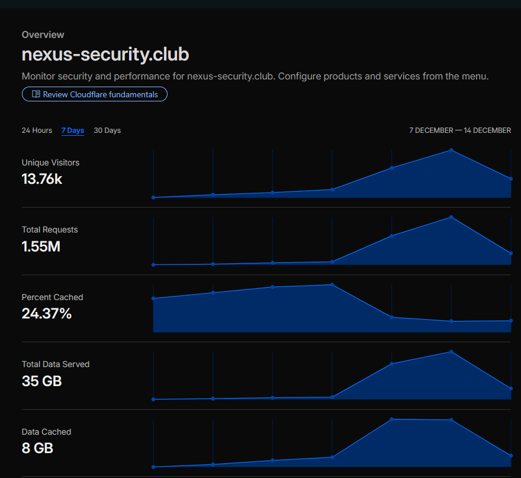
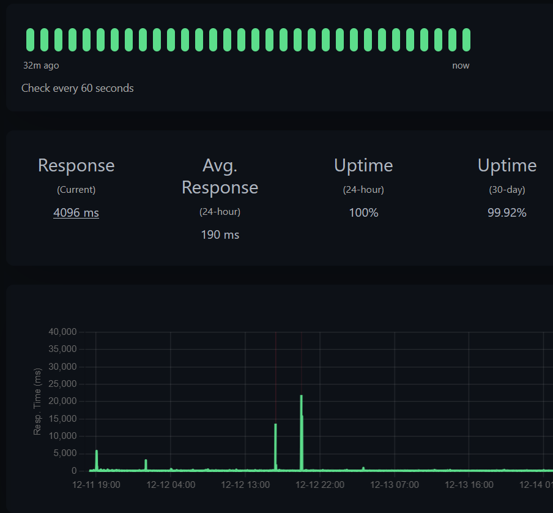
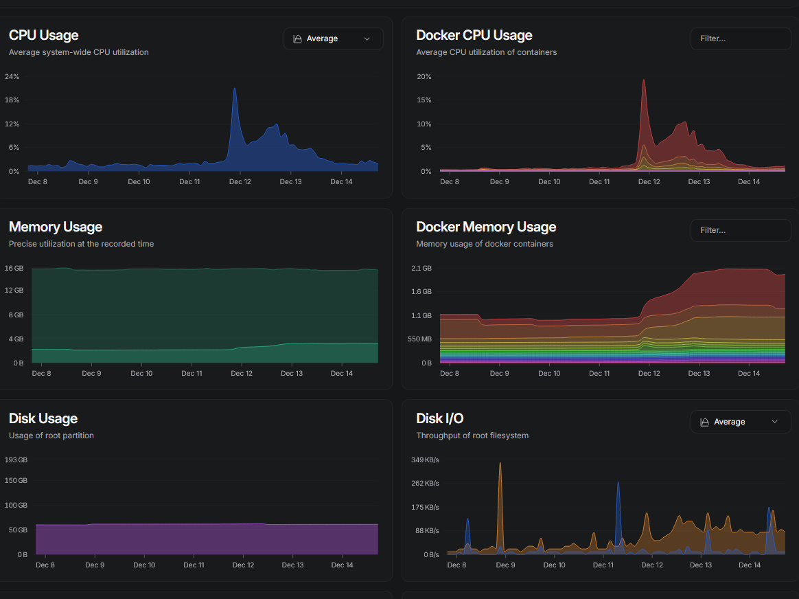
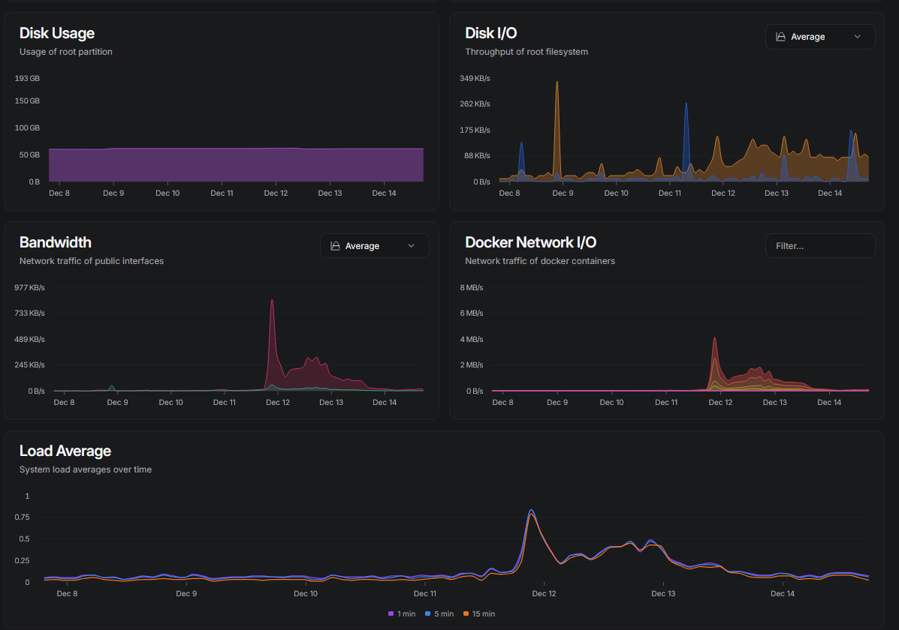
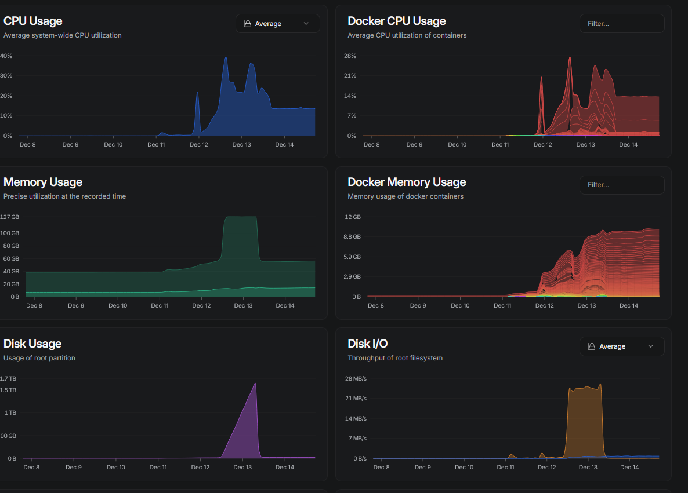
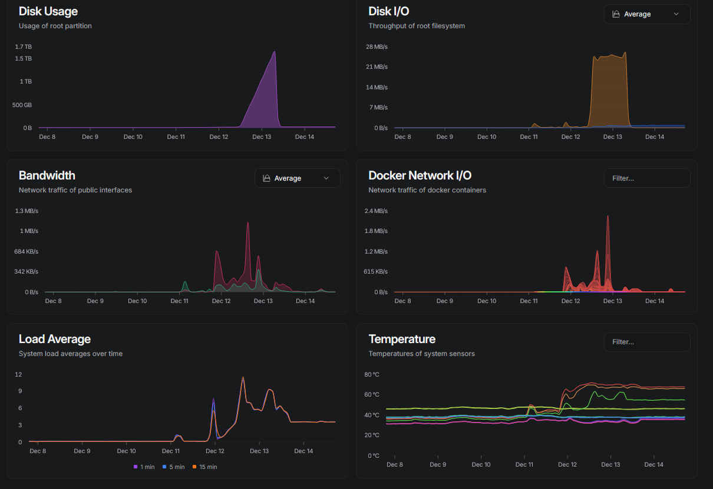
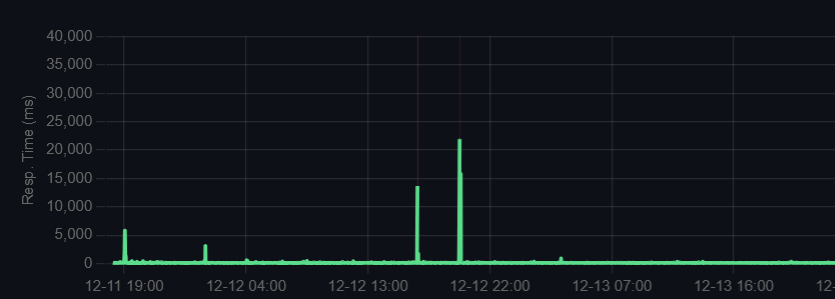

# NexHunt CTF 2025 Infrastructure Postmortem

**Authors:** 0xkatana  
**Date:** December 15, 2025  
**Reading time:** 10 min  
**Tags:** postmortem, infrastructure

## Introduction

This year marked the our first global ctf [NexHunt CTF](https://ctftime.org/event/3037), the ctf was public to  participants from around the world with ctfd. As first-time organizers, we aimed to make  a high-quality CTF experience with challenging problems and stable infrastructure and aim for a good ctfd weight. However,the ctf event was stable for a first-time and we hade a huge ammount of players thank you guys we had almost 2k players and 1k team , we encountered some  infrastructure  challenges during the event. This postmortem documents our experiences, challenges, and lessons learned to improve future iterations.

i was the main (0xkatana) the main one managing the infrastructure and challenges repository. Special thanks to L4ZEX for helping with challenge setup and NIL for monitoring challenges throughout the event.

## Event Statistics

- **Participants:** 1,909 users registered
- **Teams:** 997 teams registered
- **Unique IP addresses:** 36,095
- **Total possible points:** 15,153
- **Challenges:** 62
- **Most solved challenge:** HuntMe1 with 410 solves
- **Least solved challenge:** Labyrinth with 1 solve
- **Event duration:** 3 days
- **Start time:** December 11, 2025, 18:00 UTC
- **Overall uptime:** 99.85%

### Category Breakdown
- **Beginner:** 6 challenges
- **Blockchain:** 4 challenges
- **Crypto:** 5 challenges
- **Feedback:** 1 challenge
- **Forensics:** 7 challenges
- **Malware:** 1 challenge
- **Misc:** 7 challenges
- **OSINT:** 7 challenges
- **Pwn:** 6 challenges
- **Reverse:** 9 challenges
- **Web:** 9 challenges

### Submission Statistics
- **Fails:** 21,135
- **Solves:** 4,368

### Point Distribution
- **Beginner:** 908 points
- **Blockchain:** 569 points
- **Crypto:** 1,684 points
- **Feedback:** 1 point
- **Forensics:** 2,366 points
- **Malware:** 500 points
- **Misc:** 1,132 points
- **OSINT:** 2,403 points
- **Pwn:** 1,816 points
- **Reverse:** 1,700 points
- **Web:** 2,074 points

## Infrastructure Overview

Our infrastructure consisted of two main servers:
1. **Platform server:** Running CTFd platform  behind a cloudflare proxy , cdn and firewall and we used  Google Gmail for email services
by our hosting partner [Hawiyat.org](https://hawiyat.org)

2. **Challenge server:** A powerful Threadripper server (24 cores, 128GB RAM) provided by our hosting partner [Hawiyat.org](https://hawiyat.org)

We implemented Cloudflare as our WAF, CDN, and reverse proxy to protect the platform. The challenge deployment infrastructure was set up just 2 days prior to the event due to time constraints, which led to several issues that are detailed below.

The platform server hosted essential CTFd components including nginx, the CTFd application itself, Redis, and the database. During peak usage, the CTFd server reached a maximum of 25% CPU usage and 4GB RAM usage, but typically stabilized at under 10% usage most of the time. For future events, we plan to add more CTF containers for horizontal scalability, and enable Cloudflare caching early in the event to reduce server load.

The challenge server handled the heavy workload with more than 120 containers running on average, across a total of 15 services and Docker stacks. For each challenge that required deployment, we had a Dockerfile and a compose file. The compose files were specifically edited to support Docker Swarm deployment with replicas. In total, we had 17 challenges that needed deployments. Our automation used Docker Compose to build the image for each challenge by looping through all challenge folders.

The second stage involved creating a Docker stack from each compose file, with default replica counts of 5 for misc/pwn challenges and 7-10 replicas for web challenges. Docker Swarm provided load balancing between containers by exposing the port only. During peak usage, particularly due to resource leaks from some challenges, the server peaked at 70% CPU usage. However, after implementing resource limits of 0.5 CPU and 1GB of RAM per container, CPU usage stabilized at around 20%. The server utilized an average of 26GB of RAM during the event.

Nginx configuration with SSL and domains for challenges was ready in the middle of the CTF, but we hesitated to implement it due to the potential load on the nginx containers and the need to update all connection information for the challenges. As a result, we continued to use port-based access throughout the event. For future events, we plan to implement nginx properly to make the setup more production-ready.

### Monitoring Setup

We used multiple combinations to monitor our servers and infrastructure. Our monitoring stack included:
- **Portainer** for container management
- **Uptime Kuma** for uptime monitoring
- **Bezel** for notifications
- **Monitour** for tracking any downtime

All monitoring tools were linked with our Discord server to notify us directly of any issues, ensuring rapid response to infrastructure problems.

### Portainer Container Management

Portainer was connected to a node that is part of our Swarm cluster. It managed the following resources:
- **Stacks**: 43 total (including infrastructure and challenge stacks)
- **Services**: 21 total
- **Containers**: 246 total (117 running, 129 stopped)
- **Images**: 70 total 
- **Volumes**: 11 total
- **Networks**: 42 total

Portainer was instrumental in managing our Docker Swarm cluster, which was running version 28.5.2 with 24 nodes and 135 GB of RAM available. We used it to manage challenge deployments, monitor container health, and perform scaling operations. Some resources located on other nodes in the cluster were managed via Portainer's agent setup.

Key challenge stacks managed through Portainer included:
- ctf-gofrita (8 replicas, port 3333)
- ctf-secure-storage (10 replicas, port 6213)
- ctf-web-daveloper (5 replicas, port 3555)
- ctf-plankton (5 replicas, port 1802)
- ctf-plankton-v2 (5 replicas, port 2307)
- ctf-labyrinth (3 replicas, port 3294)

Complete list of Docker Swarm services managed during the CTF:

| Service Name | Image | Replicas | Port Mapping | Created |
|--------------|-------|----------|--------------|---------|
| ctf-00fashions_ctf-not-old-enough | ctf-00fashionsctf-not-old-enough:latest | 3/3 | 4777:1337 | 2025-12-12 14:22:20 |
| ctf---_ctf-dz-kitab | ctf---ctf-dz-kitab:latest | 10/10 | 3999:3999 | 2025-12-12 05:10:40 |
| ctf-archive-keeper_ctf-archive-keeper | ctf-archive-keeperctf-archive-keeper:latest | 5/5 | 2711:1337 | 2025-12-11 17:43:11 |
| ctf-autobashn_ctf-autobashn | ctf-autobashnctf-autobashn:latest | 5/5 | 9126:1337 | 2025-12-11 17:43:36 |
| ctf-below_ctf-below | ctf-belowctf-below:latest | 10/10 | 4132:1337 | 2025-12-12 19:08:22 |
| ctf-calculator_ctf-calculator | ctf-calculatorctf-calculator:latest | 5/5 | 3067:3000 | 2025-12-11 19:43:56 |
| ctf-classic-oracle_ctf-classic-oracle | ctf-classic-oraclectf-classic-oracle:latest | 0/0 | 4337:1337 | 2025-12-11 18:41:57 |
| ctf-ghostenote_ctf-ghostenote | ctf-ghostenotectf-ghostenote:latest | 5/5 | 2808:1337 | 2025-12-11 17:43:24 |
| ctf-gofrita | ctf-gofritactf-gofrita:latest | 8/8 | 3333:3333 | 2025-12-11 21:56:58 |
| ctf-labyrinth | ctf-labyrinthctf-labyrinth:latest | 3/3 | 3294:1337 | 2025-12-12 14:10:10 |
| ctf-made-in-china | ctf-made-in-chinactf-made-in-china:latest | 5/5 | 4800:1337 | 2025-12-11 17:45:16 |
| ctf-plankton-v2 | ctf-plankton-v2ctf-plankton-v2:latest | 5/5 | 2307:1337 | 2025-12-13 02:14:19 |
| ctf-plankton | ctf-planktonctf-plankton:latest | 5/5 | 1802:1337 | 2025-12-12 12:05:58 |
| ctf-secure-storage | ctf-secure-storagectf-secure-storage:latest | 10/10 | 6213:8080 | 2025-12-11 20:35:54 |
| ctf-tricky-t | ctf-tricky-tctf-tricky-t:latest | 5/5 | 5245:2003 | 2025-12-11 17:44:53 |
| ctf-vowbreaker | ctf-vowbreakerctf-vowbreaker:latest | 5/5 | 2761:1337 | 2025-12-11 17:44:43 |
| ctf-web-daveloper | ctf-web-daveloperctf-web-daveloper:latest | 5/5 | 3555:3555 | 2025-12-12 12:06:05 |
| new-classic-oracle | ctf-classic-oraclenew-classic-oraclectf-classic-oracle:latest | 3/3 | 4338:1337 | 2025-12-12 23:23:33 |
| new-really-secure-storage | ctf-really-super-secure-storagenew-really-secure-storageduty1g/really_super_secure_storage:latest | 10/10 | 8990:8999 | 2025-12-13 18:21:48 |
| new_super_secure_storage | ctf-secure-storagenew_super_secure_storagesuper-secure-storage:latest | 3/3 | 8999:8990 | 2025-12-13 09:52:20 |

This comprehensive setup allowed us to monitor and manage our 15 Docker Swarm services and over 120 running containers effectively throughout the event.

## Performance Statistics

During the CTF, we served a total of 2 million requests through CTFd. Cloudflare cached 25% of these requests, which contributed to improved uptime and performance. Our final uptime accuracy reached 99.92% over the last 3 days of the event, with 100% uptime during the final day. The average response time was 190ms, demonstrating the effectiveness of our caching and infrastructure setup despite the high load.

The platform server performance during the event showed interesting patterns. The CTFd server components (nginx, CTFd, Redis, and database) reached a maximum of 25% CPU usage and 4GB RAM usage during peak times, but typically stabilized at under 10% usage. This indicates the platform server was well-sized for the load.

The challenge server, running more than 120 containers on average across 15 Docker services and stacks, showed more significant load. During peak usage, particularly when some challenges had resource leaks, the server reached 70% CPU usage. However, after implementing resource limits on containers, CPU usage stabilized at around 20%. The server maintained an average of 26GB of RAM usage during the event.

*Cloudflare dashboard showing request volumes during the CTF*

*Uptime monitoring dashboard showing service availability*

*Platform server usage metrics at time A*

*Platform server usage metrics at time B*

*Challenge server usage metrics at time A*

*Challenge server usage metrics at time B*

*Response time and uptime monitoring during the event*

## Challenges Faced During the Event

### Platform Load Issues

As soon as the CTF started, we experienced a surge in traffic with over 30,000 requests in the first minute. This caused our platform latency to spike to 4.5 seconds. However, the system stabilized after approximately 3 minutes, returning to sub-200ms response times.
this was to the lack of the cache hits from the cdn and no ratelimiting rules
### Email Limitations

We quickly hit Google Gmail's daily email limits after sending over 1,000 emails. This made email delivery slow and unreliable, particularly for verification emails. We had to disable email verification within the first hour of the competition to prevent further issues.

### DDoS Attacks

We experienced multiple downtime periods caused by DDoS attacks that bypassed Cloudflare's anti-DDoS and bot protection. At 4:40 PM on December 12th, a DDoS attack caused a 2-minute website downtime. We issued an announcement asking participants to stop DDoSing the site. Another attack at 7:47 PM on December 12th caused a 4-minute downtime. Although Cloudflare's protection caught most attacks, some smart endpoints were exploited. Despite these attacks, we maintained an overall uptime of 99.85% over the 3-day event.

### Cloudflare Caching Issues

During one incident, we accidentally enabled an aggressive cache-all rule in Cloudflare, which negatively impacted user experience. Players received cached pages and cookies from other users, causing scoreboard mix-ups and challenges appearing as solved when they weren't. At 4:54 PM on December 12th, we issued a Discord announcement asking participants to clear their browser cache and cookies to resolve the issue.

Timeline:
- Platform latency spike: 4.5 seconds in first minute, stabilized after 2 minutes to sub-200ms
- DDoS attack: 2-minute attack causing 7-second latency
- Cloudflare caching issue: Brief but impactful to user experience

### Docker Swarm Load Balancer Issues

Our challenges were deployed using a combination of Docker Swarm services and stacks. For each challenge that required deployment, we had a Dockerfile and a compose file. The compose files were specifically edited to support Docker Swarm deployment with replicas. In total, we had 17 challenges that needed deployments. Our automation used Docker Compose to build the image for each challenge by looping through all challenge folders.

The second stage involved creating a Docker stack from each compose file, with default replica counts of 5 for misc/pwn challenges and 7-10 replicas for web challenges. Docker Swarm provided load balancing between containers by exposing the port only. We used Portainer UI to manage scaling and redeployment of challenges that needed it.

However, we encountered issues with Docker Swarm's port load balancer failing to forward traffic. The resolution required scaling down services to zero and then rescaling them.

Interestingly, nginx/caddy configuration with SSL and domains for challenges was ready in the middle of the CTF, but we hesitated to implement it due to the potential load on the nginx/caddy containers and the need to update all connection information for the challenges. As a result, we continued to use port-based access throughout the event instead of implementing nginx/caddy for more production-ready load balancing. i'm going for a Treafik setup next time since it is the most im familliar to 

Initially, most containers didn't have resource limits, but we later limited them to 0.5 CPU and 1GB of RAM to prevent resource exhaustion issues.

### Challenge-Specific Issues

Multiple web challenges experienced failures throughout the event. Most notably "Super Secure Storage" Web challenge that was taken down for maintenance on December 11th at 9:12 PM (as announced in Discord). Additionally, "web/gofrita" had to be taken down for maintenance at 7:24 PM on December 11th, but was brought back online by 10:08 PM the same day.

Another significant challenge issue was "PLANKTON-v2" which went down for maintenance at 12:00 AM on December 13th, but was restored by 12:43 AM the same day. PLANKTON-v2 experienced additional maintenance periods later that day, going down again at 1:43 AM and being restored by 2:16 AM (as announced in Discord).

Some challenges, particularly "Labyrinth," caused very high resource usage since containers weren't properly limited. This caused our challenge server's CPU usage to reach 70%. Implementing resource limits on containers and scaling to more instances resolved the issue.

### Resource Management

Since we didn't have time to set up proper instancer plugins (most challenges didn't require instances), we used Docker Swarm services and stacks with load balancers. Our automation process involved two stages: first, using Docker Compose to build images for each challenge by looping through all challenge folders, and second, creating Docker stacks from each compose file with specific replica counts (5 for misc/pwn challenges, 7-10 for web challenges).

We used Portainer UI extensively to manage scaling and redeployment of challenges that needed it. Challenge scaling or redeployment were mostly done through Portainer UI, which provided us with real-time visibility into container status, resource usage, and service health. Portainer allowed us to effectively manage our 43 total stacks, 21 services, and 246 containers (117 running, 129 stopped) throughout the event.

Portainer's interface gave us detailed insights into each service's replica count and resource allocation. For example, we could see that ctf-gofrita was running 8 replicas on port 3333, while ctf-secure-storage had 10 replicas on port 6213. This visibility was crucial when troubleshooting container issues and optimizing resource allocation during the event.

Initially, most containers didn't have resource limits, which led to some challenges consuming excessive resources. We later implemented resource limits of 0.5 CPU and 1GB of RAM per container to prevent resource exhaustion issues, particularly after noticing high resource usage from challenges like "Labyrinth" which caused the challenge server's CPU to reach 70%.

Additionally, nginx configuration with SSL and domains for challenges was ready in the middle of the CTF, but we chose not to implement it due to concerns about the potential load on the nginx containers and the need to update all connection information for the challenges. This decision was made to maintain stability during the event rather than risk potential issues from the infrastructure change.

## Timeline of Major Incidents

- **Dec 11, 18:00 UTC** - CTF started with over 30k requests in first minute
- **Dec 11, 18:01 UTC** - Platform latency spikes to 4.5 seconds , spike in 500 errors
- **Dec 11, 18:03 UTC** - Platform stabilizes to sub-200ms response times
- **Dec 11, 19:00 UTC** - Email verification disabled due to Gmail limits
- **Dec 11, 19:24 UTC** - Web/gofrita taken down for maintenance (Discord announcement)
- **Dec 11, 21:08 UTC** - Web/gofrita back online after maintenance (Discord announcement)
- **Dec 11, 22:00 UTC** - Super Secure Storage Web challenge taken down for maintenance (Discord announcement)
- **Dec 11, 23:05 UTC** - Docker swarm load balancer fails, services scaled to zero and back
- **Dec 12, 4:10 UTC** - Website experienced 2-minute downtime due to DDoS attack, participants asked to stop DDoSing the site (Discord announcement)
- **Dec 12, 4:15 UTC** - Announcement issued for users to clear browser cache (Discord announcement)
- **Dec 12, 7:47 UTC** - Website experienced 4-minute downtime (Discord announcement)
- **Dec 12, 12:00 UTC** - PLANKTON-v2 down for maintenance (Discord announcement)
- **Dec 12, 12:43 UTC** - PLANKTON-V2 back online after maintenance (Discord announcement)
- **Dec 13, 1:43 UTC** - PLANKTON-v2 down for maintenance again (Discord announcement)
- **Dec 13, 2:16 UTC** - PLANKTON-V2 back online after second maintenance (Discord announcement)
- **Dec 12-13** - Second phase of CTF mostly stable with minimal noticeable problems some downtime for web/pwn challengs but not a big deal

## Conclusion

Running custom infrastructure for a CTF is definitely not for the faint of heart. We took the risk by building our own solution with limited time, and though we encountered several issues during the event, we were able to maintain 99.85% uptime over the 3-day competition. While there were many challenges, we consider this a success for our first-time event.

During the event, our infrastructure handled significant load. The platform server running CTFd components (nginx, CTFd, Redis, and database) peaked at 25% CPU usage and 4GB RAM, but typically ran at under 10% CPU usage. The challenge server, running over 120 containers across 15 services and Docker stacks on average, reached 70% CPU usage during peak times due to some resource-hungry challenges, but we were able to stabilize it at around 20% CPU usage after implementing container resource limits. The challenge server utilized an average of 26GB of RAM throughout the event.

Although we had to implement many systems during the final 2 days before the CTF, we managed to keep the platform running with only minimal downtime. The experience taught us valuable lessons about infrastructure planning, resource management, and the importance of stress testing before the event.

From a technical standpoint, we learned that our Docker Swarm automation process, which involved building images by looping through challenge folders and creating Docker stacks with specific replica counts (5 for misc/pwn, 7-10 for web), was effective but would benefit from nginx integration for production-ready load balancing. We had nginx configuration with SSL and domains ready mid-CTF but chose not to deploy it to maintain stability. For future events, we plan to have this infrastructure ready from the start.

We also learned the importance of setting resource limits from the beginning (0.5 CPU and 1GB of RAM per container) rather than implementing them reactively after resource exhaustion issues occur. Portainer (version 2.33.6) proved invaluable for monitoring and managing our infrastructure, handling 43 stacks, 21 services, and 246 containers across our 24-node Docker Swarm cluster with 135GB of RAM. The real-time visibility it provided allowed us to respond quickly to scaling needs, particularly for challenges like ctf-gofrita (8 replicas) and ctf-secure-storage (10 replicas).

Additionally, we plan to add more CTF containers to enable better horizontal scalability and implement Cloudflare caching earlier in the event to reduce server load.

Overall GG to the team we made a good event that a lot of people enjoyed  in a short amount of time shoutout to nexus , cascroot , hawiyat , hope to see you guys in next events 
