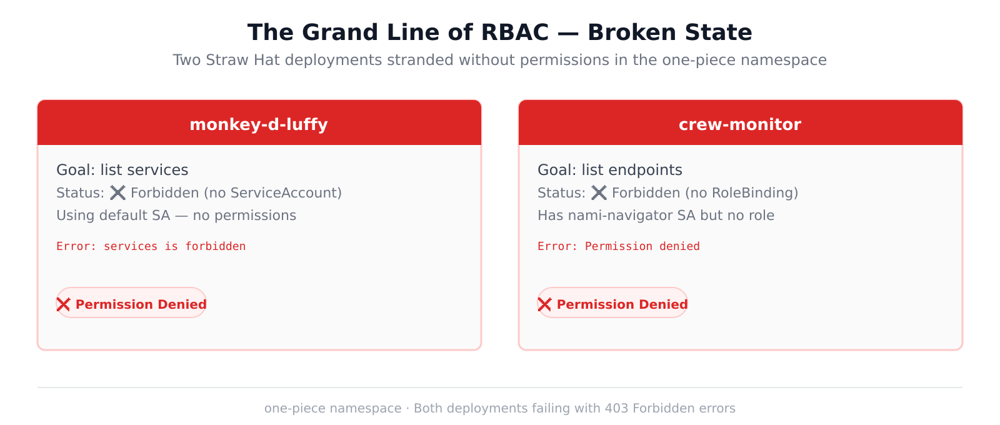
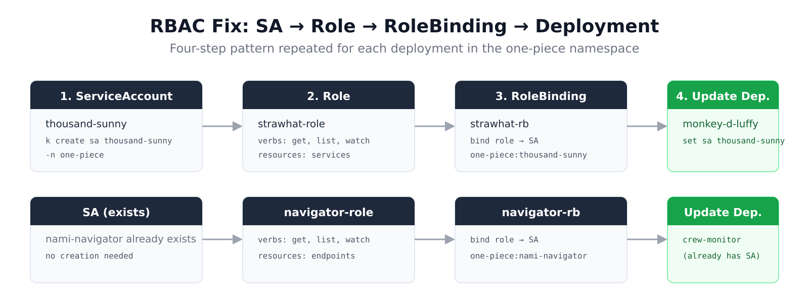
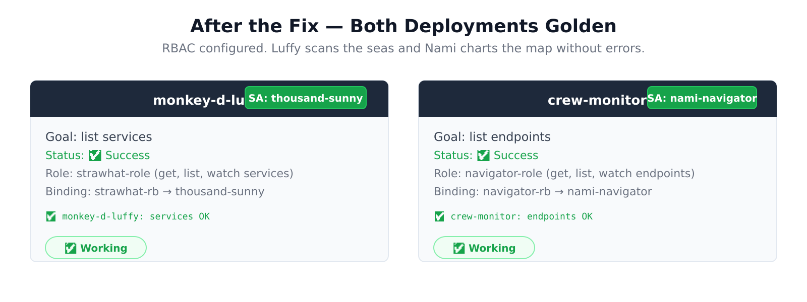

# Setting Sail: Debugging RBAC in the One Piece namespace

**Author:** katana  
**Date:** May 29, 2026  
**Reading time:** 10 min  
**Tags:** kubernetes, rbac, one-piece, ckad, troubleshooting

---

## 🏴‍☠️ The Scenario

The Straw Hat Pirates have a problem. Two of their critical monitoring applications are dead in the water, and it's not because of a Sea King attack or a Shichibukai ambush — it's because of **missing RBAC permissions** in Kubernetes.

Welcome to the `one-piece` namespace, where:
- **Monkey D. Luffy** (`monkey-d-luffy`) wants to scan the seas (list services) but the Marines keep blocking him with a 403 Forbidden
- **Nami** (`crew-monitor` via the `nami-navigator` service account) wants to chart the map (list endpoints) but the Grand Line's permission system says *nyet*

Both deployments are failing. The logs look something like this:

```
🔍 [monkey-d-luffy] Checking services at 10:15:23...
Error from server (Forbidden): services is forbidden
❌ FAILED: Permission denied
```

And:

```
🔍 [crew-monitor] Checking endpoints at 05:59:08...
❌ FAILED: Permission denied
```

Luffy can't find ships. Nami can't draw maps. **The crew is lost.**

---

## 🗺️ The Initial State



The cluster has a namespace called `one-piece` (because of course it does — someone at the company is clearly a fan of culture). Inside it:

| Deployment | ServiceAccount | Has Role? | Has Binding? | Status |
|-----------|---------------|-----------|-------------|--------|
| `monkey-d-luffy` | default | ❌ | ❌ | 403 Forbidden |
| `crew-monitor` | nami-navigator | ❌ | ❌ | 403 Forbidden |

The `monkey-d-luffy` deployment is using the **default** ServiceAccount, which has exactly zero permissions to do anything interesting (that's by design — never run production workloads on the default SA).

The `crew-monitor` deployment has a custom SA called `nami-navigator`, which is a good start, but nobody gave it any roles. Having a SA without a RoleBinding is like having Nami on the crew but not giving her a map — she exists, she's talented, but she literally cannot do her job.

---

## 🛠️ The Fix: SA → Role → RoleBinding → Profit

RBAC in Kubernetes follows a simple 4-step pattern. It's basically the Gomu Gomu no Gatling of access control — repetitive, effective, and once you learn it you never forget.



### The Thousand Sunny Gets a Crew Member (ServiceAccount)

First, Luffy's ship needs an identity. By default, pods use the `default` SA which has zero permissions. We need to give `monkey-d-luffy` its own identity:

```bash
kubectl create serviceaccount thousand-sunny -n one-piece
```

### The Straw Hat Crew Gets Rules (Role)

A Role defines what actions are allowed on what resources. Think of it as the pirate crew's code — you're allowed to do certain things, but not others:

```bash
kubectl create role strawhat-role -n one-piece \
  --verb get,list,watch \
  --resource services
```

This says: "Anyone bound to this Role can **get**, **list**, and **watch** services in the `one-piece` namespace." That's exactly what Luffy needs to scan for other ships.

### Binding the Crew to the Rules (RoleBinding)

A RoleBinding connects a Role to a ServiceAccount. This is the moment Luffy officially makes someone his nakama:

```bash
kubectl create rolebinding strawhat-rb -n one-piece \
  --role strawhat-role \
  --serviceaccount one-piece:thousand-sunny
```

The format for the `--serviceaccount` flag is `namespace:name`, not just the name. Get this wrong and you'll get a cryptic error about the binding existing but not working. Ask me how I know.

### Updating the Deployment

The deployment is still using the default SA. We need to tell it to use the shiny new `thousand-sunny` SA:

```bash
kubectl set serviceaccount deployment monkey-d-luffy \
  thousand-sunny -n one-piece
```

Or if you prefer editing the YAML directly:

```bash
kubectl edit deployment monkey-d-luffy -n one-piece
```

And change `serviceAccountName` to `thousand-sunny`.

---

## 🧭 Fixing the Navigator (Crew-Monitor)

The second deployment, `crew-monitor`, already has a ServiceAccount called `nami-navigator`. That's the good news. The bad news is it has no Role or RoleBinding. It's like having a navigator on the ship but no permission to look at the Log Pose.

We need to create:

```bash
# Create the role for endpoint discovery
kubectl create role navigator-role -n one-piece \
  --verb get,list,watch \
  --resource endpoints

# Bind it to nami's SA
kubectl create rolebinding navigator-rb -n one-piece \
  --role navigator-role \
  --serviceaccount one-piece:nami-navigator
```

Note: The `crew-monitor` deployment already has `nami-navigator` set as its SA, so we don't need to update the deployment this time. One less step. Nami's already in position — she just needed the map (permissions).

---

## ✅ Verification

After both fixes, check the logs:

```
🔍 [monkey-d-luffy] Checking services at 10:15:23...
✅ SUCCESS: Found services
```

```
🔍 [crew-monitor] Checking endpoints at 05:59:08...
✅ SUCCESS: Found endpoints
```



Both deployments can now access their required resources. Luffy can scan the seas. Nami can chart the map. **The Grand Line is safe again.**

---

## 🧠 Complete Command Reference

Here's everything end-to-end:

```bash
# Part 1: Fix monkey-d-luffy (service discovery)
kubectl create serviceaccount thousand-sunny -n one-piece
kubectl create role strawhat-role -n one-piece \
  --verb get,list,watch --resource services
kubectl create rolebinding strawhat-rb -n one-piece \
  --role strawhat-role \
  --serviceaccount one-piece:thousand-sunny
kubectl set serviceaccount deployment monkey-d-luffy \
  thousand-sunny -n one-piece

# Part 2: Fix crew-monitor (endpoint monitoring)
kubectl create role navigator-role -n one-piece \
  --verb get,list,watch --resource endpoints
kubectl create rolebinding navigator-rb -n one-piece \
  --role navigator-role \
  --serviceaccount one-piece:nami-navigator

# Verify
kubectl logs -n one-piece deployment/monkey-d-luffy
kubectl logs -n one-piece deployment/crew-monitor
```

---

## 🎯 Key Takeaways for CKAD

1. **Three things, always**: ServiceAccount + Role + RoleBinding. Missing any one = 403.

2. **The `--serviceaccount` format is `namespace:sa-name`**: When creating a RoleBinding, you must specify the full qualified name (`one-piece:thousand-sunny`), not just the SA name. The `-n` flag on `create rolebinding` sets the binding's namespace, not the SA's namespace.

3. **`default` SA has no permissions**: If your pod is using the `default` ServiceAccount and you haven't bound any roles to it, your pod can't do anything. Create a dedicated SA.

4. **Existing SA ≠ working SA**: The `nami-navigator` SA existed but was useless without a RoleBinding. Creating the SA is step 1 of 3.

5. **Deployments don't auto-update SAs**: If you create a SA after the deployment, the deployment still uses the old SA. You must explicitly update it with `kubectl set serviceaccount` or by editing the deployment.

6. **Roles are namespaced, ClusterRoles are cluster-scoped**: For resources like `services` and `endpoints` that live in a namespace, use a `Role`. For cluster-scoped resources (nodes, PVs, etc.), use a `ClusterRole` + `ClusterRoleBinding`.

---

## 🏴‍☠️ The One Piece Is Real

And it's not about treasure — it's about properly configured RoleBindings and well-scoped permissions. The real One Piece was the RBAC we configured along the way.

Check out the original challenge on [iximiuz Labs](https://labs.iximiuz.com/challenges/resolve-rbac-errors-in-multiple-deployments-94aa2ae8) — it's a great CKAD practice exercise with a wonderful sense of humor.

*Gomu Gomu no... `kubectl create rolebinding`!*

---

*Tags: kubernetes, rbac, one-piece, ckad, troubleshooting, serviceaccount*

*Challenge by Omkar Shelke on iximiuz Labs*
